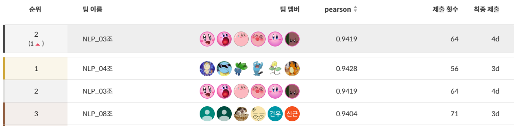
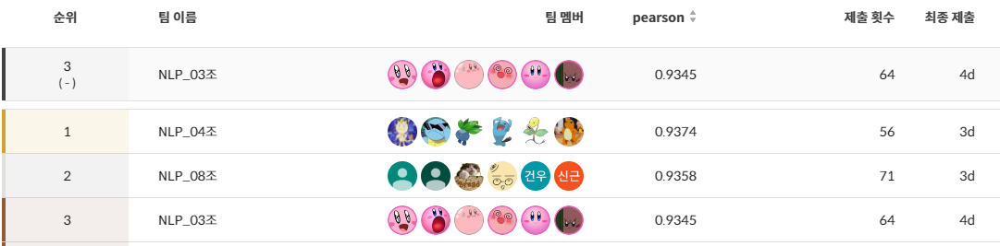
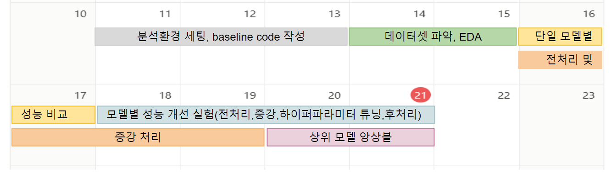
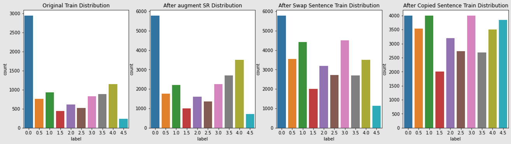

# 🏆**Level1 Project - STS(Semantic Text Similarity)**


## ✏️**대회 소개**

|특징|설명|
|:--:|--|
|**대회 주체**|네이버 부스트캠프 AI-Tech 6기 NLP트랙의 level1 도메인 기초 대회입니다.|
|**대회 설명**|두 문장이 주어졌을 때 두 문장에 대한 STS(Semantic Text Simliarity)를 추론하는 대회로 Kaggle과 Dacon과 같이 competition 형태로 진행되었습니다.|
|**데이터 구성**|데이터는 slack 대화, 네이버 영화 후기, 국민 청원 문장으로 구성되어 있습니다. Train(9324개), Dev(550개), Test(1100개) |
|**평가 지표**|모델의 평가지표는 피어슨 상관계수(Pearson correlation coefficient)로 측정했습니다.|

<br>

## 🎖️**Leader Board**
### **🥈Private Leader Board(2위)**


### **🥉Public Leader Board(3위)**



<br>

## 👨‍💻Team & Members

* **Team명** : 369 [NLP 3조]


### 🧚**Members**

|김동현|김유민|박산야|이종원|황기중|황예원|
|:--:|:--:|:--:|:--:|:--:|:--:|
|||||||
|[Github](https://github.com/valofosho)|[Github](https://github.com/miniminii)|[Github](https://github.com/SanyaPark)|[Github](https://github.com/jongwoncode)|[Github](https://github.com/merri4)|[Github](kjhwang97@gmail.com)|
|[Mail](whgdk1880@gmail.com)|[Mail](sksdjssl3148@gmail.com)|[Mail](vs501kr@gmail.com)|[Mail](uj02030@naver.com )|[Mail](kjhwang97@gmail.com)|[Mail](hwyewon@gmail.com)|


<br>

### 💯**Our Team's Goal**
> 팀 단위의 프로젝트인만큼 최대한 다양한 시도를 분업하여 서로의 내용이 겹치지 않도록 진행하였습니다. 이때 업무를 정확한 기준으로 구분하기보다 모두가 자유롭게 EDA부터 전처리, 모델 실험, 모델 튜닝까지 end-to-end로 경험하는 것을 목표로 협업하였습니다. ‘하나에 꽂히면 끝까지 판다’는 공통점을 가진 저희 팀원들의 강한 책임감과 아이디어를 향한 끈질긴(?) 애정 덕분에 성공적으로 프로젝트를 마무리할 수 있었습니다.

<br>

### 👼**Member's role**
|**Member**|**Role**|
|--|--|
|**김동현**|**EDA**(`데이터 셋 특성 분석`), **데이터 증강**(`back translation`), **모델링 및 튜닝**(`Bert, Roberta, Albert, SBERT, WandB`)|
|**김유민**|**EDA**(`label-pred 분포 분석`), **데이터 증강**(`back translation/nnp_sl_masking/어순도치/단순복제`), **모델 튜닝**(`roberta-large, kr-electra-discriminator`)|
|**박산야**|**EDA**(`label 분포 및 문장 길이 분석`), **데이터 증강**(`sentence swap`), **모델링 및 튜닝**(`KoSimCSE-roberta, 해당 모델 기반 Siamese Network 적용 모델`)|
|**이종원**|**EDA**(`label 분포 분석, label-pred 분포 분석`), **데이터 전처리**(`hanspell`), **데이터 증강**(`/swap sentence/copied sentence/SR/random masking`), **모델 튜닝**(`roberta-large, electra-kor-base, kr-electra-discriminator`), **앙상블**(`soft voting, weight voting`), **코드 리팩토링**|
|**황기중**|**데이터 전처리**(`띄어쓰기 통일`), **데이터 증강**(`부사/고유명사 제거 Augmentation`), **모델링**(`KoSimCSE-roberta`), **앙상블**(`variance-based ensemble`)|
|**황예원**|**모델링 및 튜닝**(`RoBERTa, T5, SBERT`), **모델 경량화**(`Roberta-large with deepspeed`)|

<br>

## 🏃**Project process**

### 🖥️ Project Introduction
|**개요**|**Description**|
|:--:|--|
|**프로젝트 주제** | **`STS(Semantic Text Similarity)`** : 두 문장의 유사도 정도를 수치로 추론하는 Task |
|**프로젝트 목표**| 두 문장(sentence1, sentence2)이 주어졌을 때, 이 두 문장의 유사도를 0~5사이의 점수로 추론한는 AI 모델 제작.
|**프로젝트 평가지표**|실제 값과 예측값의 피어슨 상관 계수(**Pearson Correlation Coefficient**)|
|**개발 환경**|**`GPU` : Tesla V100 Server 6대**, **`IDE` : Vscode, Jupyter Notebook**|
|**협업 환경**|**`Notion`**(진행 상황 공유), **`Figma`**(진행 상황 시각화 공유), **`Github`**(코드 및 데이터 공유), **`Slack`**(실시간 소통) |

<br>

### 📅**Project TimeLine**

* 프로젝트는 2023-12-11 ~ 2023 12-21 약 11일간 진행되었습니다.



<br>

### 🕵️**What we did**

* 프로젝트를 진행하며 단계별로 실험해 보고 적용해 본 내용들은 아래와 같습니다.

|**Process**|**What we did**|
|:--:|--|
|**EDA**|데이터 분포 분석, Baseline 모델 예측과 실제값 차이 분석|
|**Preprocessing**|`emotion normalize`, `repeat normalize`, `특수문자 제거`, `영어 소문자 처리`, `hanspell(맞춤법검사)`|
|**Augmentation**|`SR(Synonym Replacement)`, `Swap Sentence`, `Copied Sentence`, `NNP, SL Masking`, `Back Translation`, `어순 도치`, `단순 복제`|
|**Experiment Model**|`klue/RoBERTa-base`, `klue/RoBERTa-large`, `klue/bert-base`, `monologg/KoELECTRA-base`, `KETI-AIR/ke-t5-base`, `xlm-roberta-large`, `snunlp/KR-SBERT-V40K-klueNLI-augSTS`, `kykim/electra-kor-base`, `snunlp/KR-ELECTRA-discriminator`, `BM-K/KoSimCSE-roberta`, `rurupang/roberta-base-finetuned-sts`|
|**Hyper paramter tunning & Mornitoring**| `Wandb Sweep`|
|**Ensemble**|`weight voting`, `soft voting`|


<br>

### **📊DataSet**

|**Version**|**Description**|
|:--:|--|
|**AugmentationV1**|원본 데이터에서 label>=4인 데이터 단순 증강.|
|**AugmentationV2**|`원본 데이터` + `맞춤법 검사 데이터` + `SR` + `Swap Sentence` + `Copied Sentence`|
|**AugmentationV3**|`AugmentationV2` + `NNP, SL Masking`|

* 데이터 증강 과정에서 라벨 분포를 균형있게 맞추고자 **라벨별 증강 비율을 조정**하였습니다.


<br>


### 🤖**Ensemble Model**

* 최종적으로 5개의 모델을 앙상블에 사용하였습니다.

|**Model**|**Learing Rate**|**Batch Size**|**loss**|**epoch**|**Data Cleaning**|**Data Augmentation**|**Public Pearson**|**Scheduler**|**Ensemble Weight**|
|:--:|:--:|:--:|:--:|:--:|:--:|:--:|:--:|:--:|:--:|
|**klue/RoBERTa-large**|1e-5|16|L1|5|Spell Check|AugmentationV2|0.9125||0.9125|
|**klue/RoBERTa-large**|1e-5|16|MSE|2|Spell Check|AugmentationV3|0.9166||0.9166|
|**kykim/electra-kor-base**|2e-5|32|L1|23|Spell Check|AugmentationV2|0.9216|CosineAnnealingWarmRestarts|0.9216|
|**snunlp/KR-ELECTRA-discriminator**|1e-5|32|L1|15||AugmentationV1|0.9179||0.9179|
|**snunlp/KR-ELECTRA-discriminator**|2e-5|32|L1|15|Spell Check|AugmentationV2|0.9217|CosineAnnealingWarmRestarts|0.9217|

<br>

## **📁Project Structure**

### **📁디렉토리 구조 설명**
* 학습 데이터 경로 : `./data`
* 학습 코드 경로 : `./code`
* 모델 Config 경로 : `./code/config`
* 학습된 모델 생성 경로 : `./model`
* 추론 및 앙상블 결과 생성 경로 : `./result`


### **📁📁코드 구조 설명**
1. **데이터 증강 코드 위치** : `./code/augmentation.py`
    - 증강 데이터 생성 경로 : `./data/`
    
2. **Config 설정 코드 경로** : `./code/config/`
3. **Model Train 코드 위치** : `./code/train.py`
    - 모델 .pt파일 생성 경로 : `./model/`
4. **Infer & Ensemble 코드 위치** : `./code/infer.py`
    - 추론 결과 .csv파일 생성 경로 : `./result/`

```
📁level1_semantictextsimilarity-nlp-3
├─code
│  │  augmentation.py
│  │  dataloader.py
│  │  dataset.py
│  │  inference.py
│  │  learner.py
│  │  model.py
│  │  train.py
│  │  utils.py
│  │  
│  ├─config
│  │      kr_electraV1_config.py
│  │      kr_electraV2_config.py
│  │      kykim_config.py
│  │      roberta_large_config.py
│  │      roberta_large_nnp_config.py
│  │      
│  └─wrappers
│          config_wrapper.py
│          train_wrapper.py
│          
├─data
│      dev.csv
│      dev_spellcheck.csv
│      sample_submission.csv
│      test.csv
│      test_spellcheck.csv
│      train.csv
│      train_augmentV1.csv
│      train_augmentV2.csv
│      train_augmentV3.csv
│      wordnet.pickle
│      
├─model
│      klue-roberta-large-nnp.pt
│      klue-roberta-large.pt
│      kykim-electra-kor-base.pt
│      snunlp-KR-ELECTRA-discriminator-V1.pt
│      snunlp-KR-ELECTRA-discriminator-V2.pt
│      
└─result
        ensemle.csv
        klue-roberta-large-nnp.csv
        klue-roberta-large.csv
        kykim-electra-kor-base.csv
        snunlp-KR-ELECTRA-discriminator-V1.csv
        snunlp-KR-ELECTRA-discriminator-V2.csv
```
<br>

## **💻How to Start**

### **📊Make Dataset**
```
# 데이터 증강
> python ./code/augmentation.py
```

### **🤖Train Model**
```
# ./code/config 에서 훈련 모델의 config 설정
> python ./code/trian.py
```


### **🤖Infer or Ensemble Model**
```
# Infer
> python ./code/train.py --mode infer

# Ensemble
> python ./code/train.py --mode ensemble
```

